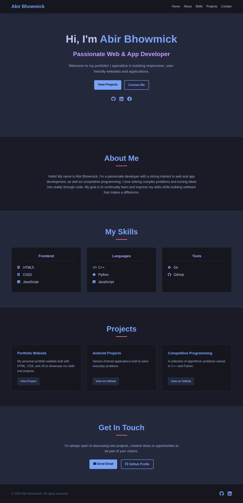

<h1 dir="auto"> Welcome to My Profile 💥 </h1>

 
 

 
 

My name is <strong><code>Abir Bhowmick</code></strong>.i'm passionate web and app developer

<h2><b>SKILL</b></h2>
<b>Frontend</b>

<b>Backend</b>  

<b>Language</b>

<b>Tools</b>

<h2><b>Project</b></h2>
<b>Web</b>
<a href="https://abir-bhowmick007.github.io/protfolio-website/" > Protfolio</a>
 

 
<b>Android</b>

<b>Competitive</b>

